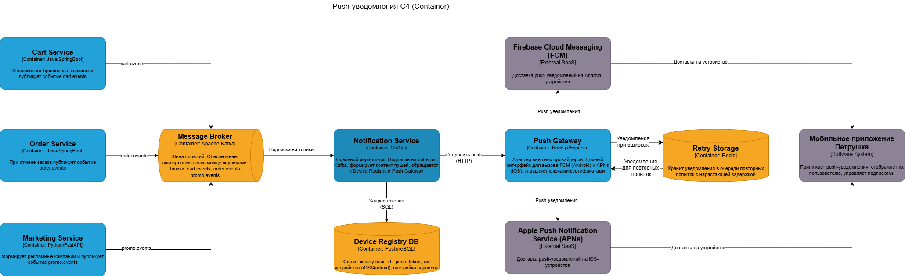

# Архитектура push-уведомлений

*Диаграмма выполнена в нотации **C4 (уровень Container)**.*

## Компоненты
- **Cart Service, Order Service, Marketing Service** - источники событий.
- **Message Broker (Kafka)** - асинхронная шина с топиками `cart.events`, `order.events`, `promo.events`.
- **Notification Service** - подписчик событий, формирует пуши, обращается к Device Registry и Push Gateway.
- **Device Registry DB** - хранит токены устройств и настройки подписок.
- **Push Gateway** - адаптер для вызова Firebase (FCM) и Apple Push (APNs).
- **Retry Storage** - хранит уведомления в Redis-очереди с нарастающей задержкой.
- **Мобильное приложение** - получает и показывает уведомления.

## Основные сценарии
### Брошенная корзина
Cart Service -> Kafka (`cart.events`) -> Notification Service -> Device Registry DB -> Push Gateway -> FCM/APNs -> приложение.

### Отмена заказа
Order Service -> Kafka (`order.events`) -> Notification Service -> ...

### Рекламная рассылка
Marketing Service -> Kafka (`promo.events`) -> Notification Service -> ...

## Обработка ошибок и гарантии доставки
- Push Gateway оборачивает вызовы FCM/APNs в механизм повторных попыток (retry). При ошибке уведомление помещается в Redis-очередь (Retry Storage) с нарастающей задержкой (exponential backoff).
- После исчерпания заданного числа попыток токен помечается как невалидный в Device Registry DB, и администратору отправляется алерт.
- Все этапы (отправка, ошибка, повтор, исключение) логируются для аудита и мониторинга.